# 🌍 Global Economic Outlook — Interactive Power BI Dashboard

An interactive single-page **Power BI dashboard** analyzing the IMF's global economic data (2001–2020) to answer a central question: **Is the economic gap widening, and is the U.S. still the world's economic power?**

The dashboard visualizes the shifting balance between the U.S. and China, the widening wealth gap across income groups, and how GDP distributes across 190+ economies — all controllable through a year-range slicer for time-based exploration.

> **TL;DR** — From 2001 to 2020, the U.S. share of world GDP dropped from ~31% to ~24% (a 6% decline), while China surged from ~4% to ~11% (a 7% gain). Meanwhile, low-income nations barely moved — the global economic gap hasn't closed in two decades.

---

## 📂 Repo Structure

```
├── dataset/
│   ├── Data.xlsx                    # IMF economic indicators (44+ features, 2001–2020)
│   └── Country Groupings.xlsx       # Income group & region mappings per country
├── assets/                          # README images (dashboard views, DAX screenshots)
├── visualization-task1.pbix         # Power BI dashboard file (open in Power BI Desktop)
├── visualization.docx               # Supporting documentation
└── README.md
```

---

## 📊 Dataset

| Property | Value |
|----------|-------|
| **Source** | International Monetary Fund (IMF) — Global Economic Outlook |
| **Period** | 2001–2020 |
| **Economies** | 190+ countries |
| **Indicators** | 44+ (GDP, inflation, PPP, exchange rates, etc.) |
| **Variables Used** | Nominal GDP (USD), PPP GDP, Country Code, Year |
| **Supplementary** | Country Groupings (income groups, regions) from IMF |

### Key Indicators Selected

Only 2 indicators from the 44+ available were used directly on the dashboard. The rest power the DAX measures and relationships behind the scenes.

| Indicator | Code | Description |
|-----------|------|-------------|
| **Nominal GDP (USD)** | `NGDPD` | GDP in current U.S. dollars — uses market exchange rates |
| **PPP GDP** | `PPPGDP` | GDP adjusted for purchasing power parity — removes exchange rate distortion |

> **Why both?** Nominal GDP reflects market-price economic size (influenced by exchange rates), while PPP GDP reflects real purchasing power. Showing both reveals whether a country's economic position shifts differently depending on the lens used. For example, China's share of world GDP is consistently higher under PPP than under Nominal because its domestic prices are lower.

### Data Quality Notes

- The dataset is ordered by country code and year, with each country having data from 2001–2020
- **Missing values exist** — countries like Andorra and San Marino lack key GDP indicators, making generalized claims on these economies difficult
- The metadata's subject notes provide crucial context for each indicator — without them, the 44+ indicators are overwhelming and prone to misinterpretation

---

## 🔍 Data Analysis & Core Observations

Before building the dashboard, two key patterns were identified from the raw data:

### Observation 1: The Global Gap Grows Exponentially

The economic gap between countries grows **exponentially** over time, for both Nominal GDP and PPP GDP. Very few countries have closed the gap on high-income nations during the 20-year period. The disparity between income groups is not shrinking — it's accelerating.

### Observation 2: U.S. Decline vs. China's Rise

| Metric | U.S. (2001→2020) | China (2001→2020) |
|--------|-------------------|-------------------|
| GDP Share Change | **−6%** (declining) | **+7%** (growing) |
| Share of World GDP (2001) | ~31% | ~4% |
| Share of World GDP (2020) | ~24% | ~11% |

These two observations shaped the dashboard's problem statement: **"The Global Economic Gap and The U.S. Position"**.

---

## 🎨 Dashboard Design

### Design Philosophy

The goal was a **simple, single-page** dashboard that directly conveys both objectives without clutter. Every visual element serves a specific analytical purpose — no decorative charts.

### Visualization Selection Rationale

When comparing relationships over time, five chart types are typically considered: Scatterplot, Bubble Plot, Line Chart, Area Chart, and Stacked Area Chart. The following were selected and why:

| Visual | Purpose | Why Chosen |
|--------|---------|------------|
| **Line Chart** (×2) | Track U.S. and China GDP share over time | Shows upward/downward trends at a glance; makes long-term economic shifts easy to follow |
| **Scatterplot** | Compare GDP distribution across all countries by income group | Highlights clustering, inequality, and outliers; ideal for showing how few countries dominate global GDP |
| **Line Chart** (×1) | Income group GDP split over time | Shows how each income tier's contribution evolves |
| **Cards** (×4) | Headline numbers (% share, % change) | Instant interpretation — key takeaway upfront before exploring detailed visuals |
| **Slicer** | Year range selector | Adds interactivity — lets viewers compare early vs. late economic behaviour |

### Dashboard Mock-up

The dashboard was sketched before implementation to plan layout and visual placement:

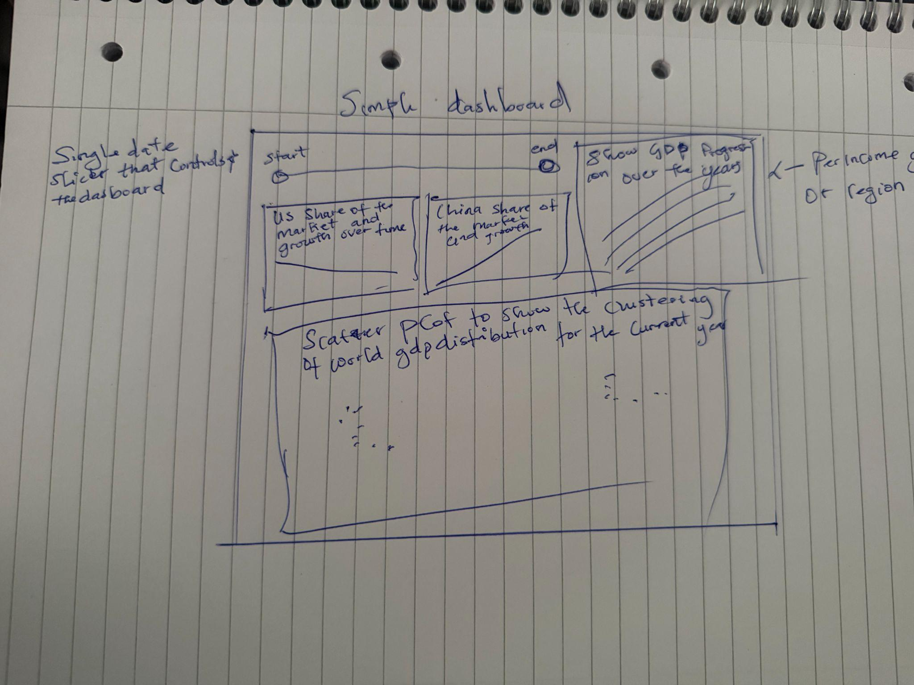

---

## 🛠️ Implementation Steps

### Step 0 — Data Import & Relationships

1. Import `Data.xlsx` (Sheet1) into Power BI
2. Import `Country Groupings.xlsx` (List of economies) — change all column types to text, rename headers, remove blank rows
3. In **Model View**, create a many-to-one relationship by dragging `ISO` (Sheet1) → `Code` (List of economies)

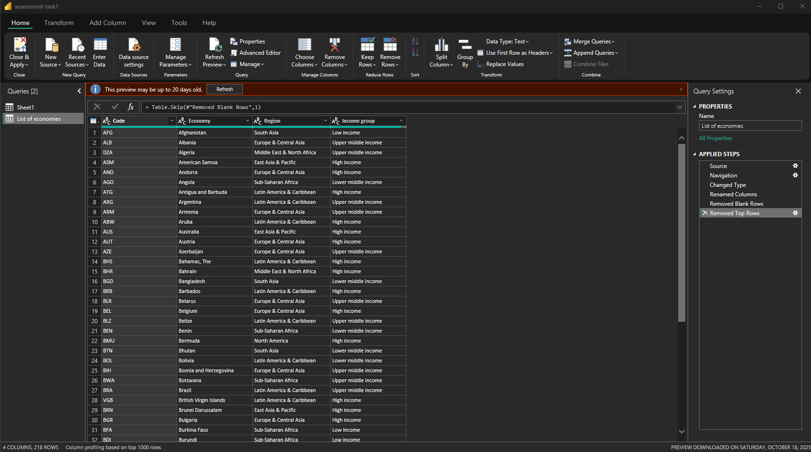

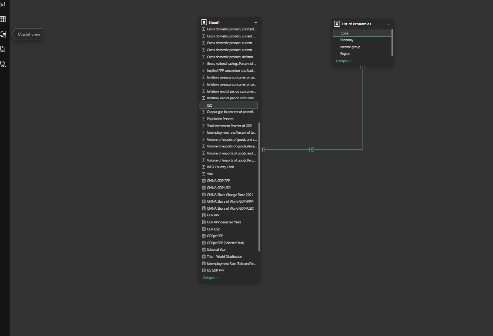

### Step 1 — DAX Measures (The Engine Behind the Visuals)

All dashboard calculations are powered by custom DAX measures. Here's the full measure chain:

#### Base Measures — Total GDP Aggregation

These sum GDP across **all countries** regardless of any country filter (using `CALCULATE` + `ALL`):

| Measure | Purpose |
|---------|---------|
| `GDP USD` | Sum of Nominal GDP for all countries |
| `GDP PPP` | Sum of PPP GDP for all countries |
| `World GDP USD` | Total world Nominal GDP (filter-proof) |
| `World GDP PPP` | Total world PPP GDP (filter-proof) |


#### Country-Specific Measures — U.S. & China GDP

Filter GDP to a single country using `CALCULATE` with a country filter:


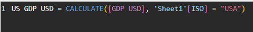

#### Share & Change Measures

Calculate each country's share of world GDP, then compute the change relative to 2001 (the baseline year):

**Prototype formula:** `US Share Change Since 2001 := U.S. current share / U.S. share when year = 2001`

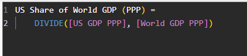
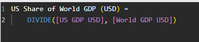
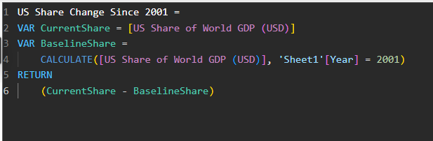

The same measure chain was duplicated and modified for China:


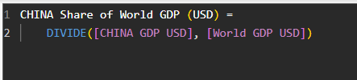
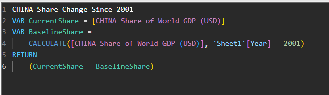

#### Scatterplot Measures — Selected Year & Income Group Rank

To make the scatterplot respond to the slicer, a `Selected Year` measure was created using `SELECTEDVALUE` (returns the slicer's value) with a `COALESCE` fallback to max year:

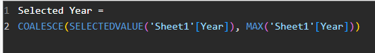
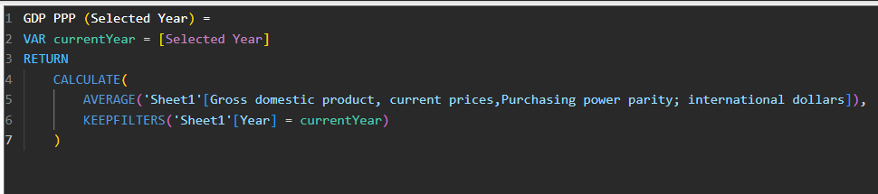
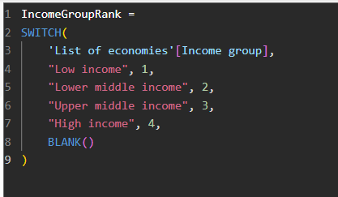

---

### Step 2 — Visualization 1: U.S. Share of World GDP

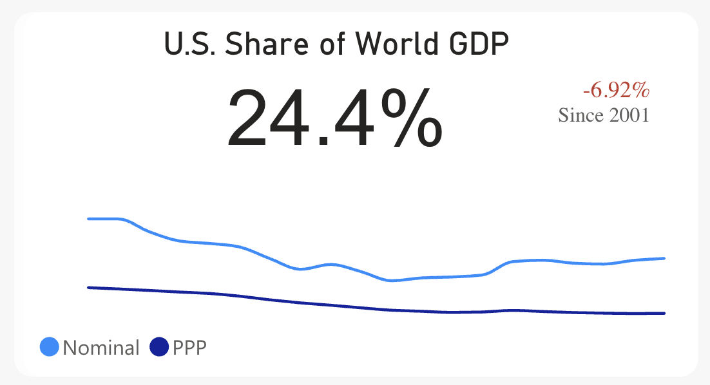

**Build steps:**
1. Insert a rectangle shape as the visual container
2. Add a **Card** → field: `US Share of World GDP (USD)` → format as percentage → title: "U.S. Share of World GDP"
3. Add a **Card (New)** → field: `US Share Change Since 2001` → format as percentage → add conditional color rule (red < 0, green > 0)
4. Add a **Line Chart** → X-axis: `Year` · Y-axis: `US Share USD` + `US Share PPP` → disable legends and Y-axis label for minimalism
5. Select all elements + rectangle → right-click → **Group** (enables duplication for China)
6. Position group top-left

### Step 3 — Visualization 2: China's Share of World GDP

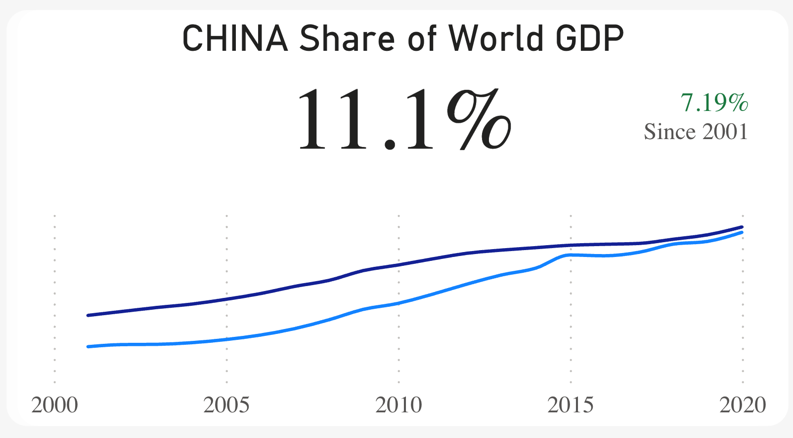

**Build steps:**
1. Duplicate the U.S. group → position adjacent
2. Swap all measures from U.S. equivalents to China equivalents

### Step 4 — Visualization 3: World GDP Distribution (Scatterplot)

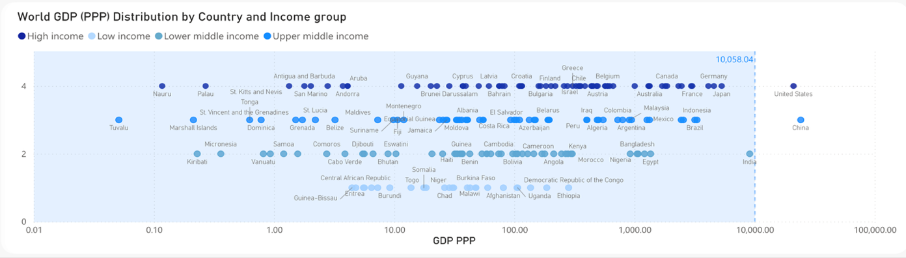

**Build steps:**
1. Insert rectangle container
2. Add **Scatter Chart** → Values: `Country` · X-axis: `GDP PPP (Selected Year)` · Y-axis: `IncomeGroupRank` · Legend: `Income group`
3. Set unique marker colors per income group for clear visual separation
4. Adjust Y-axis min/max to contain all countries and show the full GDP spread
5. Enable category labels
6. Add a **99th percentile line** to visually separate the U.S. and China from the remaining 190+ economies
7. Filter out blank income group values

> **Why the 99th percentile line?** It creates a stark visual boundary showing that the U.S. and China exist in a completely different economic league from every other nation — they sit alone above the line.

### Step 5 — Visualization 4: Income Group GDP Split

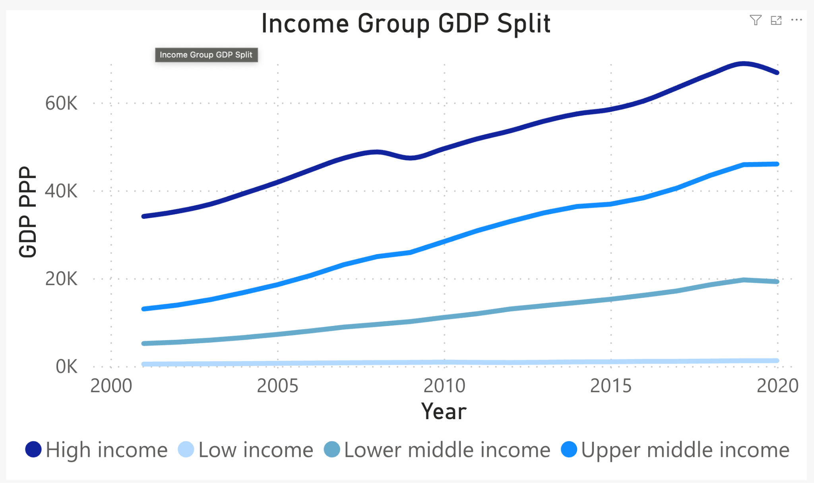

**Build steps:**
1. Add **Line Chart** → Y-axis: `GDP PPP` · X-axis: `Year` · Legend: `Income group`
2. Filter out blank income group
3. Set unique marker colors per income group

### Step 6 — Slicer


**Build steps:**
1. Insert rectangle container → add **Slicer** visualization on top
2. The slicer controls all visuals on the page — selecting a year range updates every chart and card simultaneously

---

## 📈 Final Dashboard & Key Findings

### Complete Dashboard

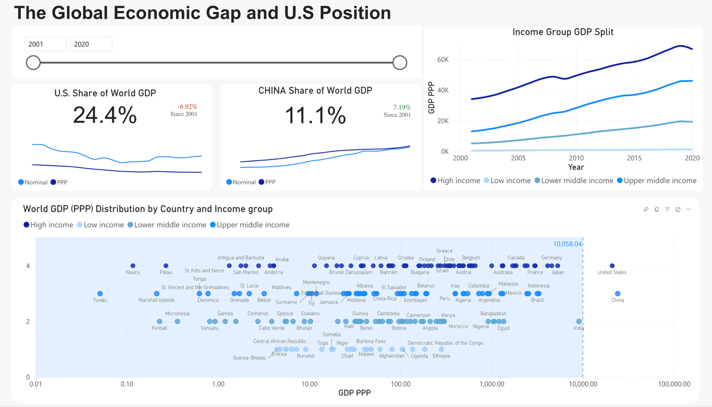

### Interactive Comparison: 2001 vs 2020

<p align="center">
  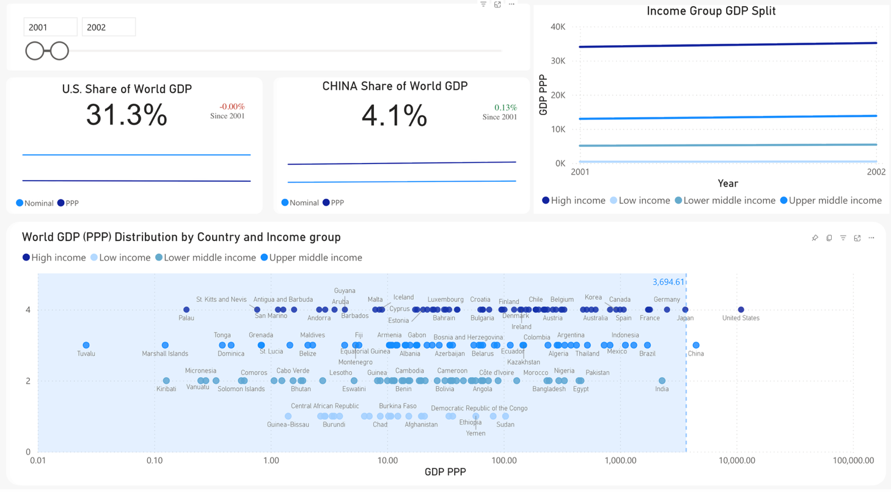
  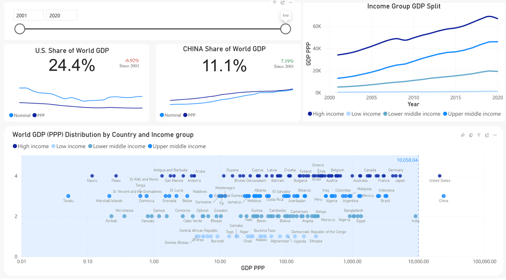
</p>

| Finding | 2001 | 2020 | Change |
|---------|------|------|--------|
| U.S. share of world GDP | ~31% | ~24% | 📉 −6% |
| China's share of world GDP | ~4% | ~11% | 📈 +7% |
| Low-income group GDP trend | Near zero | Near zero | ⏸️ Flat |
| High-income group GDP trend | Dominant | Still dominant, growing | 📈 Accelerating |

### Three Dashboard Takeaways

1. **The U.S. is losing global share** — slowly but steadily, the line trends downward across both Nominal and PPP measures
2. **China is growing into a major power** — the upward trajectory is consistent and accelerating
3. **Most of the world is still far behind** — the low-income group line barely moves across 20 years. The scatterplot shows the U.S. and China sitting far outside the 99th percentile of all other nations, and this gap hasn't closed

> The world economy moves, but it doesn't move evenly.

---

## 💡 Dashboard Design Decisions Explained

| Decision | Rationale |
|----------|-----------|
| **Single page** | Forces focus — every pixel must earn its place |
| **Cards at the top** | Headline numbers first, detail below — follows the inverted pyramid |
| **Grouped visual components** | U.S. and China sections are self-contained groups that can be compared side-by-side |
| **Slicer at the bottom** | Lets users explore any time window without disrupting the visual hierarchy |
| **99th percentile line on scatter** | The most effective way to show the U.S./China outlier status vs. the rest of the world |
| **Conditional formatting on change cards** | Red/green instantly communicates direction without reading the number |
| **Minimalist line charts** | Disabled legends and Y-axis labels to reduce visual noise — the line directions tell the story |
| **Both Nominal and PPP on same chart** | Shows whether a country's trajectory changes depending on the economic lens used |

---

## ⚠️ Limitations

| Limitation | Impact |
|-----------|--------|
| **Missing values** | Countries like Andorra and San Marino lack key GDP data — they can't be included in generalized claims |
| **Feature overload** | The original dataset has 44+ indicators; selecting the most relevant 2 required careful domain knowledge |
| **Static time window** | Data stops at 2020 — COVID-19 impact on 2020 GDP may distort the final year's readings |
| **No per-capita analysis** | GDP share doesn't account for population differences — China's per-capita GDP is still far below the U.S. |
| **Exchange rate sensitivity** | Nominal GDP is influenced by currency fluctuations; PPP mitigates this but introduces its own estimation challenges |

---

## 🏃 Quick Start

### Requirements

- **Power BI Desktop** (free download from [Microsoft](https://powerbi.microsoft.com/desktop/))

### Steps

```
1. Clone the repo
   git clone https://github.com/SapeleD3/Global-economic-outlook.git
   cd Global-economic-outlook

2. Open visualization-task1.pbix in Power BI Desktop

3. If data paths need updating:
   → Transform Data → Update source paths to point to ./dataset/

4. Use the slicer at the bottom to explore different time ranges
```

> **Note:** The `.pbix` file contains the complete dashboard with all DAX measures, relationships, and formatting pre-configured. The `dataset/` folder contains both Excel files needed if you want to rebuild from scratch.

---

## 📚 References

- International Monetary Fund. (2020). World Economic Outlook Database.
- Nathan, T. (2025). Data Visualization & Dashboard Design [Lecture slides]. University of Salford.
